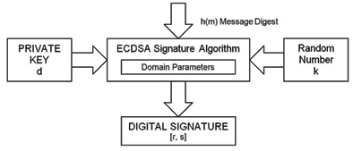
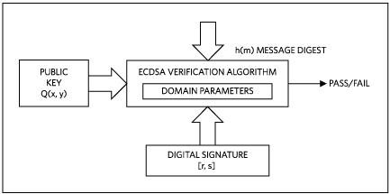

# ECDSA (Elliptic Curve Digital Signature Algorithm)

Signature algorithm is used for authenticating a device or a message sent by the device. For example consider two devices A and B. To authenticate a message sent by A, the device A **signs the message using its private key**. The device A sends the message and the signature to the device B. This signature can be **verified only by using the public key** of device A. Since the device B knows A’s public key, it can verify whether the message is indeed send by A or not.

ECDSA is a variant of the **Digital Signature Algorithm (DSA)** that operates on elliptic curve groups. For sending a signed message from A to B, both have to agree up on **Elliptic Curve domain parameters**. Sender ‘A’ have a key pair consisting of a private key dA (a randomly selected integer less than n, where n is the order of the curve, an elliptic curve domain parameter) and a public key QA = dA * G (G is the generator point, an elliptic curve domain parameter). An overview of ECDSA process is defined below.

ECDSA has three phases 

- **key generation**
- **signature generation**
- **signature verification**

# ECDSA Key Generation

An entity A's key pair is associated with a particular set of EC domain parameters $D = (q, FR, a, b, G, n, h)$. $E$ is an elliptic curve defined over $F_q$, and $P$ is a point of prime order $n$ in $E(F_q)$, $q$ is a prime. Each entity $A$ does the following 

1. Select the random integer $d$ in the interval [1, n - 1]
2. Compute $Q = d_P$
3. A's public key is Q, A's private key is $d$

# ECDSA Signature Generation

To sign a message m, an entity $A$ with domain parameters $D = (q, F_R, a, b, G, n, h)$ does the following

1. Select a random or pseudorandom integer k in the interval $[1, n-1]$

2. Compute $k_P = x_1, y_1 and r = x_1 mod (n)$ (where $x_1$ is regarded as an integer between 0 and $q - 1$). If $r = 0$, then go back to step 1

3. Compute $k^(-1) \mod (n)$

4. Compute $s = k^{-1} {h(m) + d*r} \mod (n)$, where $h$ is the Secure Hash Algorithm (SHA-1). If s = 0, then go back to step 1. 

5. The signature for the message $m$ is the pair of integers $(r, s)$

# ECDSA Signature Verification

To verify A's signature $(r, s)$ on $m, B$ obtains an authenticated copy of A's domain parameters $D = (q, F_R, a, b, G, n, h)$ and public key $Q$ and do the following: 

1. Verify that $r$ and $s$ are integers in the interval [1, n - 1]

2. Compute $w = s^{-1} \mod (n)$ and $h(m)$

3. Compute $k^{-1} \mod (n)$

4. Compute $u_1*P + u_2*Q = (x_0, y_0)$ and $v = x_0 \mod (n)$

5. Accept the signature if and only if $v = r$

